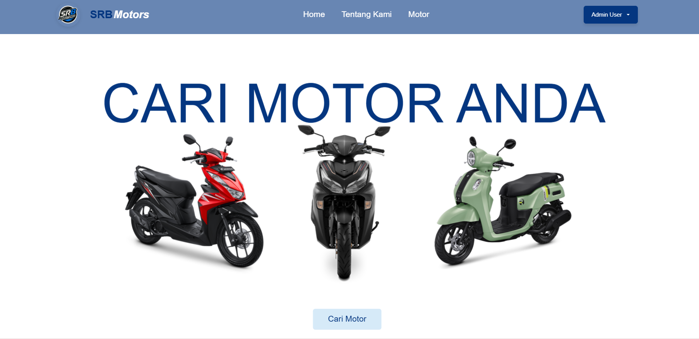
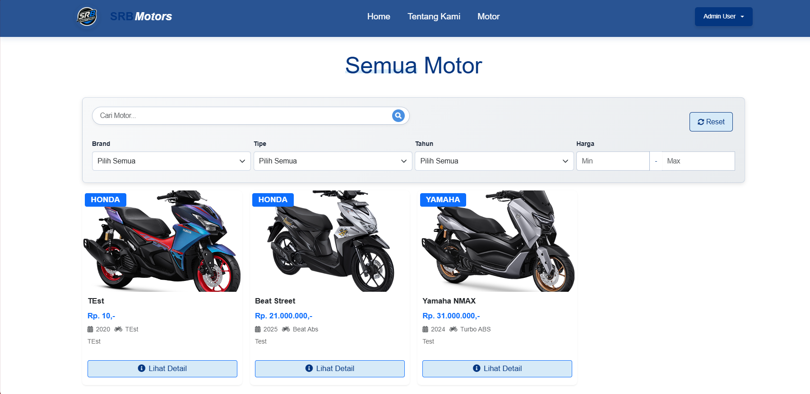
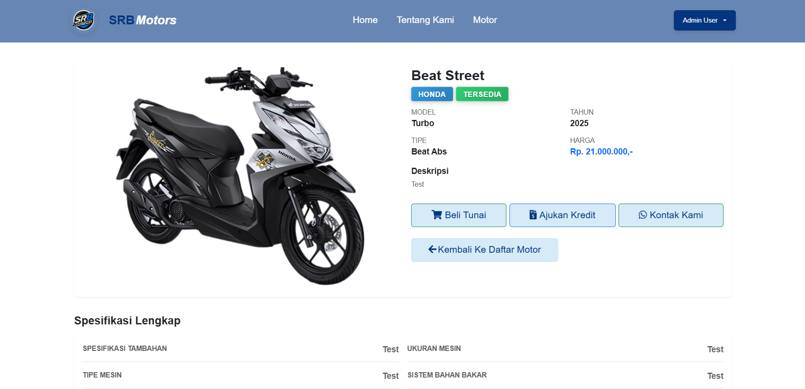

# SRB Motors - Motorcycle Sales Management Platform

<div align="center">
  
  <p><b>Modern motorcycle sales management platform built with Laravel</b></p>
  
  [](https://laravel.com)
  [](https://php.net)
  [](https://mysql.com)
  [](LICENSE)
</div>

<p align="center">
  <a href="#overview">Overview</a> • 
  <a href="#features">Features</a> • 
  <a href="#screenshots">Screenshots</a> • 
  <a href="#installation">Installation</a> • 
  <a href="#usage">Usage</a> • 
  <a href="#tech-stack">Tech Stack</a> • 
  <a href="#contributing">Contributing</a>
</p>

---

## Overview

SRB Motors is a comprehensive motorcycle sales management platform that enables dealerships to showcase their inventory, manage transactions, and provide customers with an intuitive online experience. Built with the Laravel framework, it offers a robust backend with a user-friendly interface for both customers and administrators.

The platform supports both cash and credit transactions, comprehensive motor inventory management, and a detailed admin dashboard for efficient business operations.

---

## Features

### 🏍️ **Motorcycle Management**
- **Inventory Display**: Showcases motorcycle inventory with detailed specifications
- **Brand Categories**: Organized by brands (Honda, Yamaha, etc.)
- **Detailed Specifications**: Comprehensive motor specifications view
- **Image Gallery**: High-quality motorcycle images and visual presentation

### 👥 **User Management**
- **Role-based Access**: Admin and user roles with different permissions
- **Authentication System**: Secure login and registration system
- **User Profiles**: Customer profile management

### 💼 **Transaction Management**
- **Cash Transactions**: Simple cash purchase process
- **Credit Transactions**: Installment purchase with document upload
- **Booking System**: Reserve motorcycles with booking fees
- **Status Tracking**: Real-time transaction status updates

### 🎛️ **Admin Panel**
- **Dashboard**: Comprehensive statistics and analytics
- **Motor Management**: CRUD operations for motorcycle inventory
- **Transaction Management**: Detailed transaction oversight
- **User Management**: Administer user accounts and roles
- **Document Management**: Handle credit transaction documents

### 📧 **Contact & Communication**
- **Contact Form**: Direct communication with dealership
- **Notification System**: Real-time transaction updates
- **Document Upload**: Credit application document management

### 📊 **Reporting & Analytics**
- **Transaction Reports**: Detailed financial reporting
- **Inventory Management**: Real-time stock tracking
- **Customer Information**: Comprehensive customer data management

---

## Screenshots

<div align="center">

### Homepage


### Motor Gallery


### Admin Panel Dashboard


### Motor Detail View


### About Us


</div>

---

## Installation

### Prerequisites
- PHP 8.2 or higher
- Composer
- MySQL/MariaDB
- Node.js and npm
- Apache/Nginx (e.g., XAMPP, Laragon)

### Setup Instructions

1. **Clone the repository (if applicable)**
```bash
git clone https://github.com/yourusername/srbmotors.git
cd srbmotors
```

2. **Install PHP dependencies**
```bash
composer install
```

3. **Set up environment variables**
```bash
cp .env.example .env
php artisan key:generate
```

4. **Configure your database settings in `.env`**
```env
DB_CONNECTION=mysql
DB_HOST=127.0.0.1
DB_PORT=3306
DB_DATABASE=srbmotors
DB_USERNAME=your_username
DB_PASSWORD=your_password
```

5. **Run database migrations and seeders**
```bash
php artisan migrate --seed
```

6. **Install Node.js dependencies**
```bash
npm install
```

7. **Build frontend assets**
```bash
npm run build
```

8. **Start the development server**
```bash
php artisan serve
```

9. **Access the application**
Open your browser and navigate to `http://localhost:8000`

### Default Admin Credentials
After seeding, you can log in with:
- **Email**: `admin@srbmotors.com`
- **Password**: `password`

---

## Usage

### Customer Features
1. **Browse Motors**: Explore the motorcycle inventory by brand, type, or price
2. **View Details**: See detailed specifications and images for each motorcycle
3. **Contact Dealership**: Use the contact form to get more information
4. **Place Orders**: Choose between cash or credit transactions
5. **Track Orders**: Monitor the status of your transactions

### Admin Features
1. **Dashboard Overview**: Monitor sales, inventory, and user activity
2. **Motor Management**: Add, edit, or remove motorcycles from inventory
3. **Transaction Management**: Process and track all customer transactions
4. **User Administration**: Manage user accounts and roles
5. **Document Processing**: Handle credit transaction documents

### Credit Transaction Process
1. **Apply for Credit**: Customer fills out credit application
2. **Upload Documents**: Submit required documents (KTP, KK, Pay Slip, etc.)
3. **Verification**: Admin reviews and processes documents
4. **Approval**: Credit application decision
5. **Completion**: Finalize transaction

---

## Tech Stack

<div align="center">

| Technology | Purpose |
|------------|---------|
| [Laravel 12.x](https://laravel.com) | Web Application Framework |
| [PHP 8.2+](https://php.net) | Server-side Scripting Language |
| [MySQL](https://mysql.com) | Database Management |
| [Bootstrap 5](https://getbootstrap.com) | Frontend Framework |
| [Tailwind CSS](https://tailwindcss.com) | Utility-First CSS Framework |
| [JavaScript](https://javascript.info) | Frontend Interactivity |
| [Swiper.js](https://swiperjs.com) | Image Sliders & Carousels |
| [Vite](https://vitejs.dev) | Build Tool & Development Server |
| [Maatwebsite Excel](https://laravel-excel.com) | Excel Export/Import |
| [Laravel DOMPDF](https://github.com/barryvdh/laravel-dompdf) | PDF Generation |

</div>

---

## API Endpoints

The application provides the following main API endpoints:

### Public Endpoints
- `GET /` - Homepage with motorcycle listings
- `GET /motors` - View all motorcycles
- `GET /motors/{id}` - View specific motorcycle details
- `POST /contact` - Submit contact form

### Authenticated Endpoints
- `GET /profile` - User profile
- `GET /transactions` - User transaction history
- `POST /motors/{id}/cash-order` - Place cash order
- `POST /motors/{id}/credit-order` - Place credit order
- `POST /credit-documents/{transactionId}` - Upload credit documents

### Admin Endpoints
- `GET /admin` - Admin dashboard
- `GET /admin/motors` - Manage motorcycles
- `GET /admin/transactions` - Manage transactions
- `GET /admin/users` - Manage users
- `GET /admin/contact` - View contact messages

---

## Database Schema

The application uses the following main tables:

### Core Tables
- `users` - Store user information and roles
- `motors` - Motorcycle inventory details
- `motor_specifications` - Detailed specifications for each motor
- `transactions` - Track all purchase transactions
- `credit_details` - Installment transaction details
- `documents` - Credit application documents
- `contact_messages` - Customer contact messages
- `notifications` - Real-time notifications

---

## Customization

### Brand Support
The system currently supports Honda and Yamaha brands but can be extended to support other brands:
1. Update the `brand` field options in the Motor model
2. Add appropriate brand images to the `public/assets/img/{brand}` directories

### Motor Types
The application supports various motor types including:
- Metic (Manual transmission)
- Automatic
- Sport
- Scooter
- Touring

These can be extended by modifying the motor creation form and validation rules.

---

## Performance & Security

### Security Features
- CSRF protection for all forms
- Input validation and sanitization
- Secure password hashing (bcrypt)
- Authentication with remember tokens
- Role-based access control

### Performance Optimizations
- Eloquent ORM for efficient database queries
- Caching for frequently accessed data
- Asset optimization through Vite
- Efficient image storage and retrieval

---

## Contributing

We welcome contributions to the SRB Motors platform! Here's how you can help:

1. **Fork the repository**
2. **Create a feature branch** (`git checkout -b feature/AmazingFeature`)
3. **Commit your changes** (`git commit -m 'Add some AmazingFeature'`)
4. **Push to the branch** (`git push origin feature/AmazingFeature`)
5. **Open a Pull Request**

### Development Guidelines
- Follow Laravel best practices
- Write clear commit messages
- Include tests where applicable
- Maintain consistent code style
- Document any new features

---

## License

This project is licensed under the MIT License - see the [LICENSE](LICENSE) file for details.

---

## Support & Contact

If you have any questions, suggestions, or issues with the SRB Motors platform:

- **Open an Issue**: Use the GitHub Issues tab to report bugs or suggest features
- **Email**: Contact us at admin@srbmotors.com
- **Documentation**: Check our Wiki for detailed setup and customization instructions

---

<div align="center">

**SRB Motors** © 2025 | Built with ❤️ using Laravel

[Back to top](#srb-motors---motorcycle-sales-management-platform)

</div>