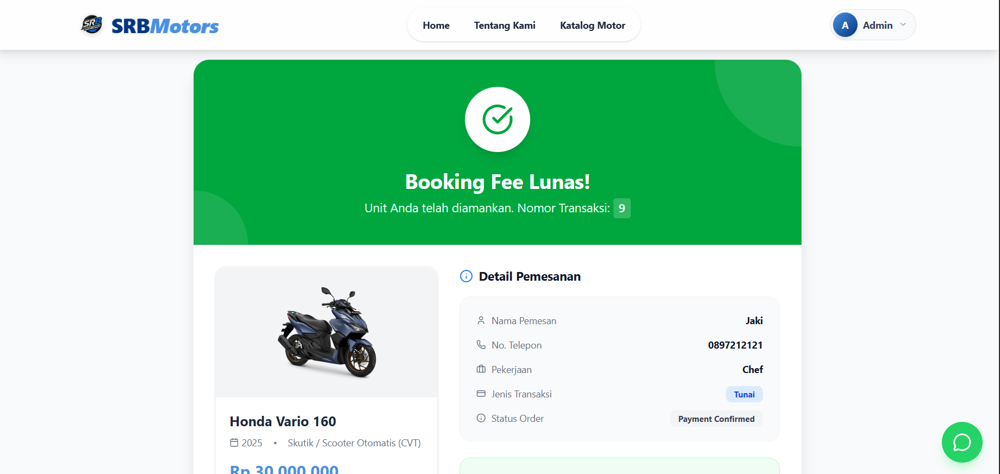
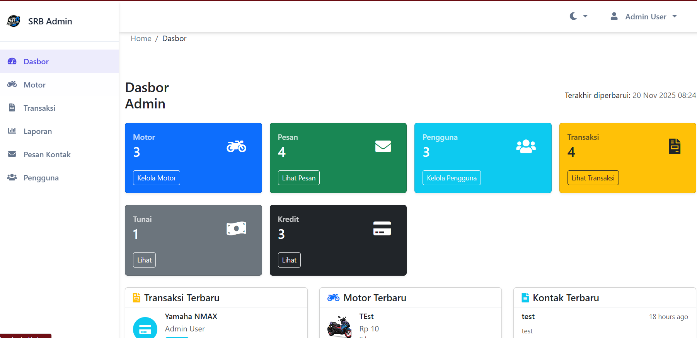
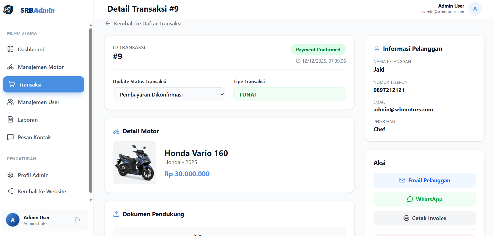

# SRB Motors - Platform Manajemen Penjualan Motor

<div align="center">
  
  <p><b>Platform manajemen penjualan motor modern berbasis Laravel</b></p>
  
  [](https://laravel.com)
  [](https://php.net)
  [](https://mysql.com)
  [](LICENSE)
</div>

<p align="center">
  <a href="#gambaran-umum">Gambaran Umum</a> • 
  <a href="#fitur">Fitur</a> • 
  <a href="#tangkapan-layar">Tangkapan Layar</a> • 
  <a href="#instalasi">Instalasi</a> • 
  <a href="#penggunaan">Penggunaan</a> • 
  <a href="#teknologi-yang-digunakan">Teknologi</a> • 
  <a href="#kontribusi">Kontribusi</a>
</p>

---

## Gambaran Umum

SRB Motors adalah platform manajemen penjualan motor yang komprehensif yang memungkinkan dealer untuk menampilkan inventaris mereka, mengelola transaksi, dan memberikan pelanggan pengalaman online yang intuitif. Dibangun dengan framework Laravel, platform ini menawarkan backend yang kuat dengan antarmuka pengguna yang ramah untuk pelanggan dan administrator.

Platform ini mendukung transaksi tunai dan kredit, manajemen inventaris motor yang komprehensif, serta dashboard admin terperinci untuk operasional bisnis yang efisien.

---

## Fitur

### 🏍️ **Manajemen Motor**

-   **Tampilan Inventaris**: Menampilkan inventaris motor dengan spesifikasi terperinci
-   **Kategori Merek**: Dikelompokkan berdasarkan merek (Honda, Yamaha, dll.)
-   **Spesifikasi Terperinci**: Tampilan spesifikasi motor yang komprehensif
-   **Galeri Gambar**: Gambar motor berkualitas tinggi dan presentasi visual

### 👥 **Manajemen Pengguna**

-   **Akses Berbasis Peran**: Peran admin dan pengguna dengan izin berbeda
-   **Sistem Autentikasi**: Sistem login dan registrasi yang aman
-   **Profil Pengguna**: Manajemen profil pelanggan

### 💼 **Manajemen Transaksi**

-   **Transaksi Tunai**: Proses pembelian tunai yang sederhana
-   **Transaksi Kredit**: Pembelian cicilan dengan unggah dokumen
-   **Sistem Pemesanan**: Reservasi motor dengan biaya pemesanan
-   **Pelacakan Status**: Pembaruan status transaksi secara real-time

### 🎛️ **Panel Admin**

-   **Dashboard**: Statistik dan analitik komprehensif
-   **Manajemen Motor**: Operasi CRUD untuk inventaris motor
-   **Manajemen Transaksi**: Pengawasan transaksi terperinci
-   **Manajemen Pengguna**: Mengelola akun dan peran pengguna
-   **Manajemen Dokumen**: Menangani dokumen transaksi kredit

### � **Sistem Pembayaran & Keuangan**

-   **Integrasi Midtrans**: Pembayaran aman dan otomatis untuk Booking Fee dan Pelunasan.
-   **Online Full Payment (Pelunasan)**: Fitur pelunasan online otomatis untuk pembeli cash.
-   **Invoice & Kuitansi**: Pembuatan invoice otomatis dan kuitansi pembayaran.

### 📱 **Notifikasi & Komunikasi**

-   **WhatsApp Gateway**: Notifikasi otomatis real-time ke Admin dan Customer (Order Baru, Status Update, Bukti Bayar).
-   **Email Notifications**: Pemberitahuan via email untuk update penting.
-   **Formulir Kontak**: Komunikasi langsung dengan dealer.

### 📊 **Laporan & Analitik**

-   **Laporan Transaksi**: Pelaporan keuangan terperinci.
-   **Ekspor Data**: Dukungan ekspor laporan ke PDF dan Excel.
-   **Statistik Dashboard**: Grafik penjualan dan overview performa real-time.

---

## Tangkapan Layar

<div align="center">

### Halaman Utama


### Galeri & Detail Motor

<div style="display: flex; gap: 10px; justify-content: center;">


</div>

### Konfirmasi Pesanan & Pembayaran (Fitur Baru)



### Dashboard Admin



### Detail Motor (Admin View)



### Tentang Kami


</div>

---

## Instalasi

### Prasyarat

-   PHP 8.2 atau lebih tinggi
-   Composer
-   MySQL/MariaDB
-   Node.js dan npm
-   Apache/Nginx (misalnya XAMPP, Laragon)

### Instruksi Instalasi

1. **Clone repositori (jika berlaku)**

```bash
git clone https://github.com/namapenggunaanda/srbmotors.git
cd srbmotors
```

2. **Instal dependensi PHP**

```bash
composer install
```

3. **Atur variabel lingkungan**

```bash
cp .env.example .env
php artisan key:generate
```

4. **Konfigurasi pengaturan database di `.env`**

```env
DB_CONNECTION=mysql
DB_HOST=127.0.0.1
DB_PORT=3306
DB_DATABASE=srbmotors
DB_USERNAME=nama_pengguna
DB_PASSWORD=kata_sandi
```

5. **Jalankan migrasi database dan seeder**

```bash
php artisan migrate --seed
```

6. **Instal dependensi Node.js**

```bash
npm install
```

7. **Bangun aset frontend**

```bash
npm run build
```

8. **Jalankan server pengembangan**

```bash
php artisan serve
```

9. **Akses aplikasi**
   Buka browser dan navigasikan ke `http://localhost:8000`

### Kredensial Admin Default

Setelah seeding, Anda dapat login dengan:

-   **Email**: `admin@srbmotors.com`
-   **Kata Sandi**: `password`

---

## Penggunaan

### Fitur Pelanggan

1. **Jelajahi Motor**: Telusuri inventaris motor berdasarkan merek, tipe, atau harga
2. **Lihat Detail**: Lihat spesifikasi dan gambar terperinci untuk setiap motor
3. **Kontak Dealer**: Gunakan formulir kontak untuk mendapatkan informasi lebih lanjut
4. **Tempatkan Pesanan**: Pilih antara transaksi tunai atau kredit
5. **Lacak Pesanan**: Pantau status transaksi Anda

### Fitur Admin

1. **Ringkasan Dashboard**: Pantau penjualan, inventaris, dan aktivitas pengguna
2. **Manajemen Motor**: Tambah, edit, atau hapus motor dari inventaris
3. **Manajemen Transaksi**: Proses dan lacak semua transaksi pelanggan
4. **Administrasi Pengguna**: Kelola akun dan peran pengguna
5. **Pemrosesan Dokumen**: Tangani dokumen transaksi kredit

### Proses Transaksi Kredit

1. **Ajukan Kredit**: Pelanggan mengisi formulir aplikasi kredit
2. **Unggah Dokumen**: Kirim dokumen yang diperlukan (KTP, KK, Slip Gaji, dll.)
3. **Verifikasi**: Admin meninjau dan memproses dokumen
4. **Persetujuan**: Keputusan aplikasi kredit
5. **Penyelesaian**: Finalisasi transaksi

---

## Teknologi Yang Digunakan

<div align="center">

| Teknologi                                                    | Tujuan                           |
| ------------------------------------------------------------ | -------------------------------- |
| [Laravel 12.x](https://laravel.com)                          | Framework Aplikasi Web           |
| [PHP 8.2+](https://php.net)                                  | Bahasa Skrip Server-side         |
| [MySQL](https://mysql.com)                                   | Manajemen Database               |
| [Bootstrap 5](https://getbootstrap.com)                      | Framework Frontend               |
| [Tailwind CSS](https://tailwindcss.com)                      | Framework CSS Utility-First      |
| [JavaScript](https://javascript.info)                        | Interaktivitas Frontend          |
| [Swiper.js](https://swiperjs.com)                            | Slider & Carousel Gambar         |
| [Vite](https://vitejs.dev)                                   | Alat Build & Server Pengembangan |
| [Maatwebsite Excel](https://laravel-excel.com)               | Ekspor/Impor Excel               |
| [Laravel DOMPDF](https://github.com/barryvdh/laravel-dompdf) | Pembuatan PDF                    |

</div>

---

## Endpoint API

Aplikasi menyediakan endpoint API berikut:

### Endpoint Publik

-   `GET /` - Halaman utama dengan daftar motor
-   `GET /motors` - Lihat semua motor
-   `GET /motors/{id}` - Lihat detail motor tertentu
-   `POST /contact` - Kirim formulir kontak

### Endpoint Terotentikasi

-   `GET /profile` - Profil pengguna
-   `GET /transactions` - Riwayat transaksi pengguna
-   `POST /motors/{id}/cash-order` - Tempatkan pesanan tunai
-   `POST /motors/{id}/credit-order` - Tempatkan pesanan kredit
-   `POST /credit-documents/{transactionId}` - Unggah dokumen kredit

### Endpoint Admin

-   `GET /admin` - Dashboard admin
-   `GET /admin/motors` - Kelola motor
-   `GET /admin/transactions` - Kelola transaksi
-   `GET /admin/users` - Kelola pengguna
-   `GET /admin/contact` - Lihat pesan kontak

---

## Skema Database

Aplikasi menggunakan tabel utama berikut:

### Tabel Inti

-   `users` - Menyimpan informasi dan peran pengguna
-   `motors` - Detail inventaris motor
-   `motor_specifications` - Spesifikasi terperinci untuk setiap motor
-   `transactions` - Melacak semua transaksi pembelian
-   `credit_details` - Detail transaksi cicilan
-   `documents` - Dokumen aplikasi kredit
-   `contact_messages` - Pesan kontak dari pelanggan
-   `notifications` - Notifikasi real-time

---

## Kustomisasi

### Dukungan Merek

Sistem saat ini mendukung merek Honda dan Yamaha tetapi dapat diperluas untuk mendukung merek lain:

1. Perbarui opsi bidang `brand` di model Motor
2. Tambahkan gambar merek yang sesuai ke direktori `public/assets/img/{brand}`

### Jenis Motor

Aplikasi mendukung berbagai jenis motor termasuk:

-   Metic (transmisi manual)
-   Automatic
-   Sport
-   Scooter
-   Touring

Ini dapat diperluas dengan memodifikasi formulir pembuatan motor dan aturan validasi.

---

## Kinerja & Keamanan

### Fitur Keamanan

-   Perlindungan CSRF untuk semua formulir
-   Validasi dan sanitasi input
-   Hashing kata sandi yang aman (bcrypt)
-   Otentikasi dengan token ingat
-   Kontrol akses berbasis peran

### Optimisasi Kinerja

-   ORM Eloquent untuk kueri database yang efisien
-   Caching untuk data yang sering diakses
-   Optimisasi aset melalui Vite
-   Penyimpanan dan pengambilan gambar yang efisien

---

## Kontribusi

Kami menyambut kontribusi terhadap platform SRB Motors! Berikut cara Anda dapat membantu:

1. **Fork repositori**
2. **Buat branch fitur** (`git checkout -b fitur/FiturHebat`)
3. **Lakukan commit perubahan Anda** (`git commit -m 'Tambahkan beberapa FiturHebat'`)
4. **Push ke branch** (`git push origin fitur/FiturHebat`)
5. **Buka Pull Request**

### Panduan Pengembangan

-   Ikuti praktik terbaik Laravel
-   Tulis pesan commit yang jelas
-   Sertakan pengujian jika berlaku
-   Jaga konsistensi gaya kode
-   Dokumentasikan fitur baru

---

## Lisensi

Proyek ini dilisensikan di bawah Lisensi MIT - lihat file [LISENSI](LICENSE) untuk detail lengkap.

---

## Dukungan & Kontak

Jika Anda memiliki pertanyaan, saran, atau masalah dengan platform SRB Motors:

-   **Buka Issue**: Gunakan tab GitHub Issues untuk melaporkan bug atau menyarankan fitur
-   **Email**: Hubungi kami di admin@srbmotors.com
-   **Dokumentasi**: Periksa Wiki kami untuk instruksi instalasi dan kustomisasi terperinci

---

<div align="center">

**SRB Motors** © 2025 | Dibangun dengan ❤️ menggunakan Laravel

[Kembali ke atas](#srb-motors---platform-manajemen-penjualan-motor)

</div>
